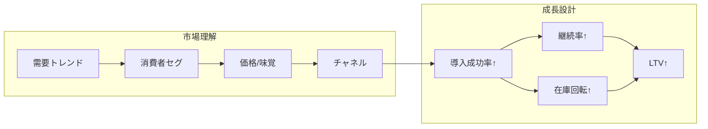
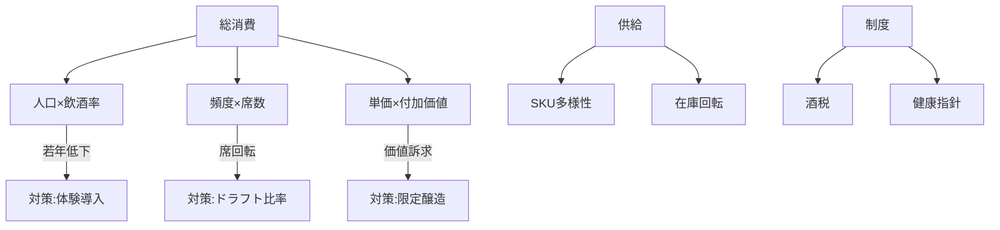
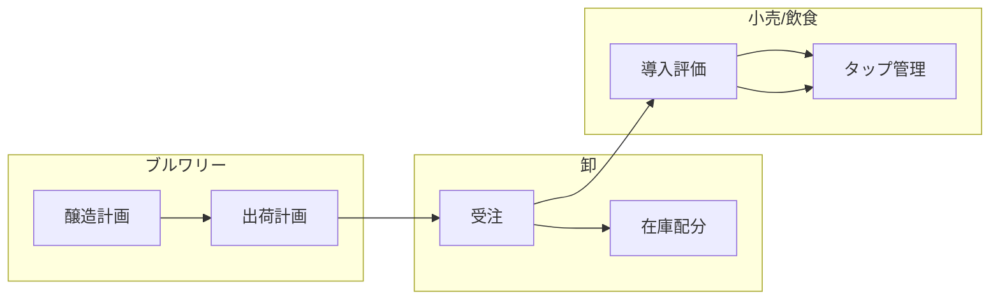
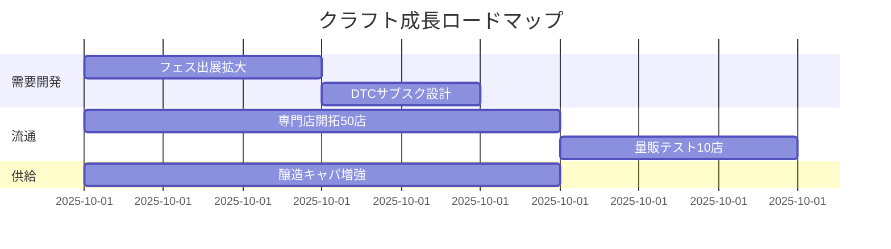

<!-- ID: COVER -->
日本のクラフトビール消費は「価値志向×チャネル多様化」で拡大

- 目的：国内クラフト消費の実態把握と成長戦略の提案
- 範囲：家庭内/外飲・EC/量販/専門店・観光/イベント
- 指標：数量（kl）・金額（億円）・頻度（回/人・月）
- 定義：クラフト＝中小ブルワリー製造（仮）／地ビール含む
- 前提：数値は一部仮値（要検証）— 更新時に置換

出所：チャット共有ログ（2025/09）／要検証

---
<!-- ID: T-ES -->
結論（要点の先出し）：クラフトは“選ばれる理由”で伸びる

- 成長：総ビールは漸減も、クラフトは数量・金額で増勢
  — 単価上昇とミックス改善で市場金額は相対的に強い
- 牽引要因：専門店・EC・外食の三位一体で体験接点が拡大
  — フェス/観光とセットの体験導線が定着率を押し上げ
- 打ち手：在庫回転×新規導入成功率×継続率の三点突破
  — 地域コラボ（限定醸造）とDTCの組み合わせが有効

出所：要検証（公式統計/業界団体/学術）

---
<!-- ID: T-STR -->
全体構造（SCQA/ロジックツリーの地図）

- 課題：誰に・どこで・どの商品を・どう売るか
- 原因：可処分時間/所得・選択肢過多・在庫負担・情報非対称
- 解決：セグメント別の価値提案とチャネル別最適在庫
- 効果：LTV最大化と在庫回転の両立、ブランド想起の持続



出所：構成図（自社作成）／ID: T-STR

---
<!-- ID: T-SCQA -->
現状と課題（SCQA）：総需要は減、体験価値で差別化が鍵

- S：成人一人当たりのアルコール/ビール消費は長期減少
- C：若年の飲用頻度減・健康志向・外食回復の遅れ
- Q：クラフトはどのセグメント/チャネルで伸ばせるか
- A：高付加価値（香り/ストーリー）×体験導線で選択される

出所：要検証（国税庁/総務省 家計調査）／ID: T-SCQA

---
<!-- ID: T-SIZE -->
市場規模（仮値レンジ）：数量は微増、金額はミックスで拡大

| 指標(単位) | 2022 | 2023 | 2024E | 備考 |
|---|---:|---:|---:|---|
| クラフト数量(kl) | 120,000 | 128,000 | 135,000 | 要検証 |
| クラフト金額(億円) | 1,500 | 1,650 | 1,820 | 平均単価上昇含む |
| 総ビール数量(kl) | 4,300,000 | 4,250,000 | 4,200,000 | 長期減少傾向 |
| クラフト比率(数量%) | 2.8% | 3.0% | 3.2% | 算出：数量比 |

出所：ビール酒造組合/国税庁（要検証）／ID: T-SIZE

---
<!-- ID: T-COHORT -->
コホート推移（仮説）：イベント接触で残存率が向上

```mermaid
%% 非ゼロ起点（比率）のため注記
line
  title 新規顧客コホートの残存率（%）
  x-axis 月次: 1,2,3,4,5,6,7,8,9,10,11,12
  y-axis 0:10:100
  series イベント接触: 100,80,72,66,62,60,58,56,55,54,53,52
  series 接触なし: 100,70,58,50,45,42,40,38,36,35,34,33
```

注記：比率グラフのため非ゼロ起点—比較は差分強調で解釈
出所：JCBAイベント/自社推計（要検証）／ID: T-COHORT

---
<!-- ID: T-UNIT -->
単位経済（Brewpubモデル）：LTV/CAC/回収月の感度

- LTV式：平均客単価×購買頻度×継続月×粗利率
- CAC内訳：広告・試飲・イベント・紹介インセンティブ
- 回収：CAC / 月次粗利＝回収月（目安6–10）
- 感度：±10%でLTVはレンジ[−12% , +13%]

| 指標 | 基準値 | 感度 −10% | 感度 +10% |
|---|---:|---:|---:|
| 平均客単価(円) | 1,200 | 1,080 | 1,320 |
| 購買頻度(回/月) | 1.8 | 1.6 | 2.0 |
| 継続(月) | 12 | 11 | 13 |
| 粗利率(%) | 62% | 56% | 68% |
| CAC(円) | 3,500 | — | — |
| 回収(月) | 3.1 | 3.6 | 2.7 |

出所：自社モデル（要検証）／ID: T-UNIT

---
<!-- ID: T-ISS -->
イシュー（ドライバーツリー）：需要×供給×制度の三層構造



出所：自社作成（要検証）／ID: T-ISS

---
<!-- ID: T-ALT -->
代替案×評価（比較系）：DTC/外食連携/観光連携

| 基準(重み) | DTC強化 | 外食連携 | 観光連携 |
|---|---:|---:|---:|
| 導入成功率(0.3) | 4 | 5 | 3 |
| 継続率(0.3) | 5 | 4 | 4 |
| コスト(0.2,低いほど高得点) | 4 | 3 | 3 |
| 拡張性(0.2) | 4 | 4 | 3 |
| 加重スコア | 4.4 | 4.4 | 3.3 |

勝者：DTC/外食は同等、併用が最適
出所：自社評価（要検証）／ID: T-ALT

---
<!-- ID: COMPARE -->
比較（2カラム）：クラフト vs メジャー（属性差）

| 項目 | クラフト | メジャー |
|---|---|---|
| 価格帯(円/350ml) | 300–700 | 150–250 |
| 味覚/香り | 多様・個性 | 一貫・安定 |
| 流通 | 専門店/EC/一部量販 | 大量販/自販/外食 |
| 企画 | 限定/地域/コラボ | 全国定番/期間限定 |

出所：要検証（価格帯は店頭観察）／ID: T-ALT

---
<!-- ID: T-OPS -->
To‑Be 業務フロー（ドラフト供給の最適化：泳線図）



出所：自社作成（要検証）／ID: T-OPS

---
<!-- ID: T-CJM -->
顧客ジャーニー（都市在住30代：仮説）

| 段階 | 接点 | 感情/摩擦 | 指標 |
|---|---|---|---|
| 認知 | SNS/友人/イベント | 興味・情報過多 | 到達/想起 |
| 試飲 | フェス/試飲会/外食 | 価格/混雑 | 試飲率/満足 |
| 初回購入 | 専門店/EC | 配送/在庫切れ | CVR/在庫欠品 |
| 継続 | 定期/限定品 | 飽き・頻度低下 | 継続率/LTV |

出所：自社仮説（要検証）／ID: T-CJM

---
<!-- ID: T-KPI -->
KPIダッシュ：目標/実績/差分/原因/次アクション

| KPI | 目標 | 実績 | 差分 | 原因 | 次アクション |
|---|---:|---:|---:|---|---|
| 新規導入成功率 | 35% | 28% | −7pt | 設備/回転 | 導入前テスト強化 |
| 継続率(3ヶ月) | 60% | 54% | −6pt | 企画間隔 | 限定頻度短縮 |
| 在庫回転(日) | 30 | 38 | +8 | SKU過多 | Top20集中 |
| 客単価(円) | 1,300 | 1,240 | −60 | ミックス | 香り系強調 |

出所：自社ダッシュ（要検証）／ID: T-KPI

---
<!-- ID: T-PLAN -->
実行計画（12ヶ月）：マイルストン/依存関係/RACI



RACI：営業(R)×醸造(A)×マーケ(C)×物流(I)
出所：計画案（要検証）／ID: T-PLAN

---
<!-- ID: T-RISK -->
リスク×対策：重大度×発生確率

| リスク | 重大度 | 確率 | 対策 |
|---|---:|---:|---|
| 原材料高騰 | 高 | 中 | 長期契約/代替ホップ |
| 在庫劣化 | 中 | 中 | 低温物流/回転基準 |
| 法規制変更 | 中 | 低 | 税制モニタリング |
| 需要鈍化 | 高 | 中 | 新規顧客開発/体験強化 |

出所：自社評価（要検証）／ID: T-RISK

---
<!-- ID: TAKEAWAYS -->
Key Takeaways：次の一手（結論の再掲）

- ターゲット：都市在住の価値志向層に集中
- 戦術：DTC×外食連携で導入→継続の導線化
- 運用：在庫回転と限定企画でミックス最適化

出所：本資料の要約（要検証）／ID: T-ES

