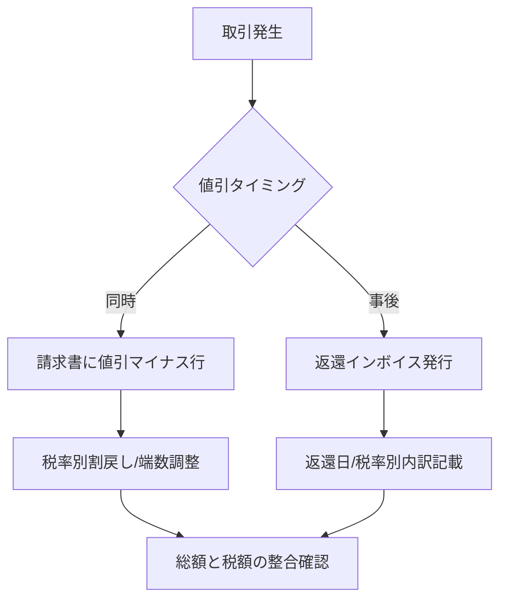
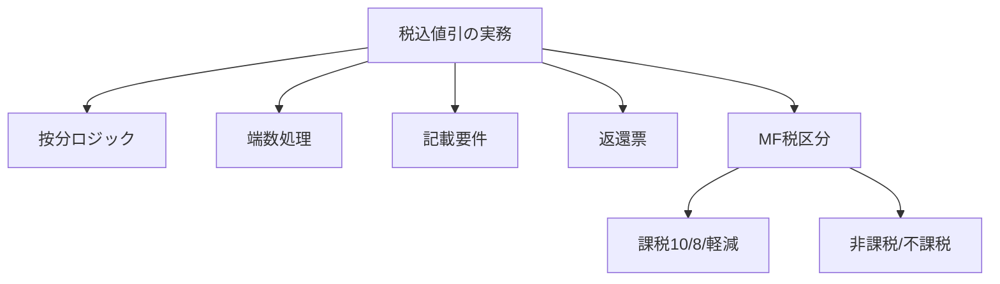
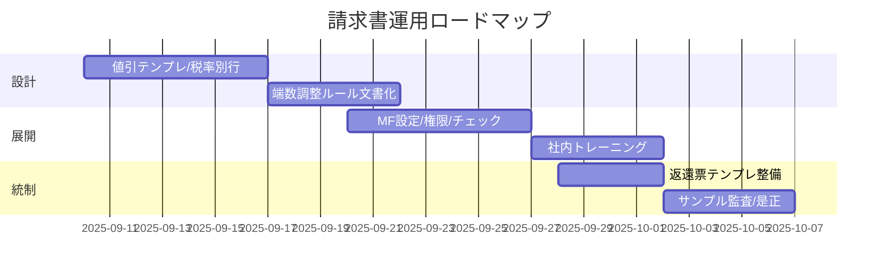

<!-- ID: COVER -->
税込1,000円引きは「対価の減少」—税率ごとに割戻し・整合

- 対象：適格請求書発行事業者／マネーフォワード請求書
- 論点：税込割引の税抜割戻し・複数税率按分・記載要件
- 区分：課税／非課税／不課税（MF仕様差異を明確化）
- タイミング：取引時値引と返還インボイスの使い分け
- 前提：本資料は要点の整理（最終判断は顧問税理士へ）

出所：国税庁インボイス制度・各社ヘルプ（要検証）

---
<!-- ID: T-ES -->
結論（要点）：「税込1,000円引」は税率別に割戻し・税額も減額

- 値引は対価の減少：税抜対価と消費税を同時に減額
  — 税込1,000円→10%なら税抜▲909.09／税▲90.91
- 複数税率は按分：税込構成比で1,000円を分割→税率別に割戻し
  — 10%:8%=6:4なら600/400で各税率処理
- 請求書は税率グループ単位で整合：合計の税額と一致させる端数調整
  — マイナス行（値引）を税率ごとに起票

出所：国税庁「適格請求書の記載事項」（要検証）／ID: T-ES

---
<!-- ID: T-STR -->
全体構造（ロジックマップ）：結論→根拠→実務→システム

出所：構成図（自社作成）／ID: T-STR

---
<!-- ID: T-SCQA -->
現状/課題（SCQA）：インボイス要件下での割引表現を統一

- S：適格請求書では税率ごとの税抜対価額と税額の記載が必須
- C：税込クーポンの一括控除は税率整合・端数で不一致が生じうる
- Q：最小労力で制度適合かつ監査に耐える記載運用は？
- A：税率別マイナス行＋端数調整ルール＋返還票の標準化

出所：国税庁Q&A（要検証）／ID: T-SCQA

---
<!-- ID: T-SIZE -->
数値基礎（単一税率10%）：税込1,000円引きの割戻し

| 指標 | 数値 |
|---|---:|
| 税込割引額(円) | 1,000 |
| 税抜減額(円) | 909.09 |
| 消費税減額(円) | 90.91 |
| 算式 | 1,000÷1.10＝909.09／差＝90.91 |

注：半角数値・小数2桁、端数処理は社内基準に統一
出所：制度要件の一般原理（要検証）／ID: T-SIZE

---
<!-- ID: T-UNIT -->
複数税率の按分（例）：税込売上の構成比で配分→税率別に割戻し

| 区分 | 税率 | 税込売上(円) | 構成比 | クーポン按分(円) | 税抜減額(円) | 税額減額(円) |
|---|---:|---:|---:|---:|---:|---:|
| A | 10% | 6,000 | 60% | 600 | 545.45 | 54.55 |
| B | 8% | 4,000 | 40% | 400 | 370.37 | 29.63 |
| 合計 | — | 10,000 | 100% | 1,000 | 915.82 | 84.18 |

注：端数は税率グループで調整し、合計の税額と一致させる
出所：国税庁Q&A（要検証）／ID: T-UNIT

---
<!-- ID: T-OPS -->
運用フロー：取引時値引 vs 事後値引（返還インボイス）

出所：運用図（自社作成）／ID: T-OPS

---
<!-- ID: COMPARE -->
非課税と不課税（MF仕様の差分）—定義と影響の比較

| 項目 | 非課税 | 不課税（対象外） |
|---|---|---|
| 定義 | 課税取引だが非課税扱い | そもそも消費税の対象外 |
| 例 | 土地利子・住宅賃料等 | 給与・寄付・損害賠償・実費立替 |
| インボイス表示 | 税率/税額なし（非課税区分） | 税率/税額なし（対象外区分） |
| 課税売上割合 | 分母に含み控除割合に影響 | 原則含まない |
| MF設定 | 「非課税」区分を選択 | 「不課税/対象外」区分を選択 |

出所：マネーフォワード請求書ヘルプ/基本通達（要検証）／ID: T-ALT

---
<!-- ID: T-ISS -->
論点ツリー（MECE）：値引・按分・端数・記載・証跡

出所：自社作成（要検証）／ID: T-ISS

---
<!-- ID: T-ALT -->
代替案×評価（値引の表現方法）—推奨は税率別マイナス行

| 基準(重み) | 税率別マイナス行 | 小計から一括控除 | ヘッダ値引 |
|---|---:|---:|---:|
| 制度適合(0.4) | 5 | 3 | 2 |
| 端数整合(0.2) | 5 | 3 | 2 |
| 運用容易(0.2) | 4 | 4 | 5 |
| 監査追跡(0.2) | 5 | 3 | 2 |
| 加重スコア | 4.8 | 3.3 | 2.6 |

勝者：税率別マイナス行（MFで税区分を一致）
出所：自社評価（要検証）／ID: T-ALT

---
<!-- ID: T-PLAN -->
実行計画（4週）：テンプレ整備→ルール周知→監査対応

RACI：経理(A)×営業(R)×情シス(C)×監査(I)
出所：計画案（自社）／ID: T-PLAN

---
<!-- ID: T-KPI -->
KPI/インパクト：誤請求率↓・差戻し率↓・作成時間↓

| KPI | 目標 | 現状 | 影響 |
|---|---:|---:|---|
| 税額不一致率(%) | 0.5 | 2.0 | 端数ルールで低減 |
| 返還票発行率(%) | 5.0 | 9.0 | タイミング基準で適正化 |
| 作成時間(分/件) | 5 | 9 | テンプレ化で短縮 |

出所：社内KPI（仮値）／ID: T-KPI

---
<!-- ID: T-RISK -->
リスク×対策：重大度×確率

| リスク | 重大度 | 確率 | 対策 |
|---|---:|---:|---|
| 端数差異で税額不一致 | 高 | 中 | 税率グループ端数統一/最小差分調整 |
| 誤区分（非課税/不課税） | 高 | 中 | MF区分の定義表/承認フロー |
| 返還票漏れ | 中 | 中 | 事後値引の検知と月次レビュー |
| 監査証憑不足 | 中 | 低 | テンプレと操作ログ保存 |

出所：自社評価（要検証）／ID: T-RISK

---
<!-- ID: TAKEAWAYS -->
Key Takeaways：制度適合×運用容易性×監査耐性を同時達成

- 税率別マイナス行＋端数ルールで制度適合と整合性
- 非課税/不課税の使い分けをMF上で明確化
- 返還インボイスの標準テンプレで証跡を堅牢化

出所：本資料の要約（自社）／ID: T-ES

