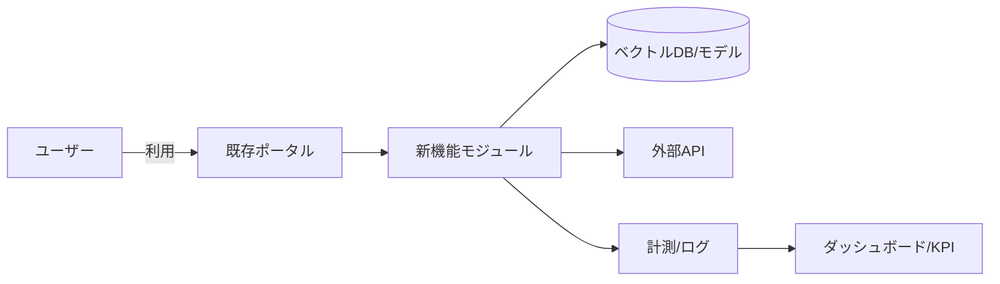

marp: true
theme: default
paginate: true
title: 新サービス発表（SmartBrief：社内ナレッジ要約・検索AI）
author: SlideMaker
header: 新サービス発表
footer: 機密 — 社内限定

<!-- _class: lead -->

# 新サービス発表
## SmartBrief（社内ナレッジ要約・検索AI）

- 対象: 経営陣
- 目的: 新機能のGo判断を得る

発表者: SlideMaker  日付: 2025-09-03

---

## エグゼクティブサマリ（要請）

- 提案: SmartBrief を既存ポータルに追加し、検索成功率/TTFV/アクティブ率を改善
- 期待効果（6カ月）: 検索成功率 +10〜15pt、TTFV -30〜40%、週次アクティブ +8〜12pt
- コスト/リスク: 推論/インデクシング運用コスト／機密データ取扱い・幻覚（緩和策あり）
- 依頼事項: 追加予算 ¥20–30M、専任3–4名、クローズドβ承認

---

## 背景と課題

- 現状: 検索の無反応率 28%、平均探索時間 6.5分、重複質問のチケット比率 22%
- 課題: 情報の分散とメタデータ不足で探索コストが高い
- 機会: 生成AIの普及で既存資産×AIによりTTV短縮・回答精度を向上
- 成功条件: 経営目標との整合、3ヶ月で検証、12ヶ月でスケール

---

## 提案概要（価値仮説）

- コア価値: 正確な回答を30秒以内に根拠付きで提供
- 主要ユースケース: 会議要約/要点抽出、Runbookからの手順回答、製品FAQの根拠提示
- 成功指標: 先行（参照率/クリック率/初回完了）と遅行（CSAT/NPS/工数削減）で検証

---

## しくみ（高レベル設計）

---

## 市場・競合状況（要点）

- 市場規模: 生成AI×業務支援は急拡大、主要SaaSが標準同梱
- 成長ドライバー: モデル高精度化、企業内データ活用、セキュリティ整備
- 主要プレイヤー: Microsoft Copilot、Google Duet/AI、Notion AI、Confluence AI
- 当社の立ち位置: 既存ポータル/権限連携/データ網羅性を強みに差別化可能

---

## 競合比較（2カラム）

::: columns
::: column
### 当社（提案）

- 差別化1: マルチリポジトリ横断検索と根拠付き回答
- 差別化2: 既存SAML/権限の継承と迅速導入
- リスク: データ品質・幻覚

:::
::: column
### 主要競合

- 強み: 既存ワークスペース内の体験は強力
- 弱み: マルチソース横断や根拠提示の自由度は限定的
- リスク: 価格攻勢・囲い込み

:::
:::

---

## ロードマップ（12カ月）

- Q1: 仕様確定・コネクタ実装（Confluence/Jira/Drive）・プロトタイプ・クローズドβ（〜100名）
- Q2: オープンβ・計測と反復・スケール設計（権限継承/監査ログ）
- Q3: 正式版・Price/Packaging検証・運用SLA整備
- Q4: 拡張機能（高度要約/翻訳）・外部連携・他部門/海外展開検証

---

## KPI（目標と閾値）

- 主要KPI: 検索成功率 +10〜15pt、TTFV -30〜40%、週次アクティブ +8〜12pt
- 先行指標: 回答参照率、引用リンククリック率、初回利用完了率
- 品質指標: エラー率、レイテンシ、CSAT/NPS
- 事業指標: チケット流入率、工数削減、将来の有償化指標

---

## 次アクション（意思決定事項）

- Go判断: 本日承認可否（条件付き可）
- 予算/人員: 追加予算 ¥20–30M、専任 3–4名 を確保
- マイルストン: β開始 2025-10／正式版 2026-01（目安）
- オーナー: PdM ＜氏名＞、Eng Lead ＜氏名＞、Ops ＜氏名＞

---

## 用語定義 / 前提

- 用語定義: TTV（Time To First Value）= 初回価値体験までの時間
- 対象ユーザー: 情報探索の多い知的労働者（CS/営業/開発/企画）
- 対応範囲: 社内ドキュメント横断の検索/要約/回答（根拠提示含む）
- 前提条件: 権限継承・機密保持・監査ログ提供、データ持ち出し禁止
